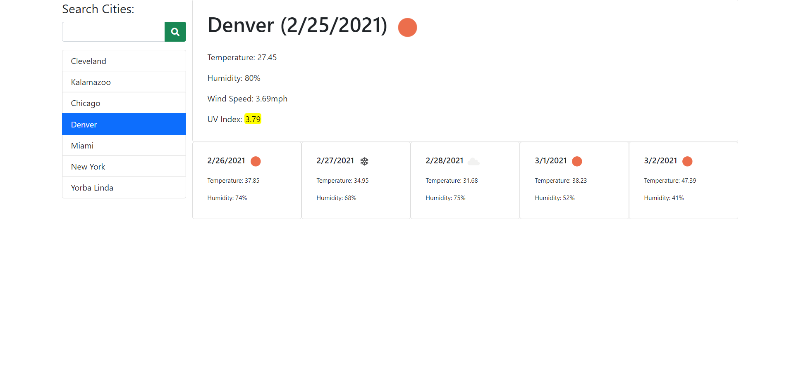

# Weather-Dashboard

This application can tell you the current and future weather for any city you search for.

The list of names will update every time a valid name is searched. When the list is at ten cities, every subsequent new city search will take the bottom city of the list. Every time a city already on the list is searched, the list will rearrange itself to have the city on top.

After a city is searched, the current weather will be displayed next to the search bar, and a five day forecast will appear beneath that.

Clicking on a city on the list will update the weather forecast to that city's forecast.

Link to Website: https://djlongarms.github.io/Weather-Dashboard/

Screenshot of the website: 